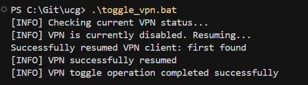

# UniFi UCG Ultra VPN Client Manager
Quickly enable or disable VPN client profiles on your UCG Ultra router from both **Windows** and **Linux/MacOS** with simple batch/shell scripts.
*Example: Running the Windows batch script to toggle VPN status*


## Quick Start

### 1. Install
```bash
pip install -r requirements.txt
```

### 2. Configure
```bash
python unifi_vpn_manager.py --create-config
```
Edit the generated `unifi_config.json`:
```json
{
    "controller_url": "https://192.168.1.1",
    "username": "admin", 
    "password": "your_password",
    "site": "default",
    "debug": false
}
```

### 3. Use - Platform Specific

#### Windows
```cmd
toggle_vpn.bat
```

#### Linux/macOS
```bash
./toggle_vpn.sh
```

#### Manual Commands (All Platforms)
```bash
# Check status
python unifi_vpn_manager.py --action status

# Pause VPN
python unifi_vpn_manager.py --action pause

# Resume VPN
python unifi_vpn_manager.py --action resume
```

## Commands

| Action | Command |
|--------|---------|
| **Status** | `python unifi_vpn_manager.py --action status` |
| **Pause** | `python unifi_vpn_manager.py --action pause` |
| **Resume** | `python unifi_vpn_manager.py --action resume` |
| **Specific VPN** | `python unifi_vpn_manager.py --action pause --vpn-name "Surfshark"` |

## Options

```
--action {pause,resume,status}    Action to perform
--vpn-name VPN_NAME              Target specific VPN client
--config CONFIG                  Config file path (default: unifi_config.json)
--create-config                  Generate sample config file
--controller-url URL             UniFi Controller URL
--username USERNAME              UniFi username  
--password PASSWORD              UniFi password
--site SITE                      UniFi site (default: default)
```

## Requirements

- Python 3.6+
- UniFi Network Controller (UCG Ultra, UDM, Cloud Key)
- Admin access to UniFi Controller

## Debug Mode

Enable verbose logging by setting `"debug": true` in your config file:
```json
{
    "debug": true
}
```

**Debug Off** (default): Only errors logged to file, silent operation
**Debug On**: Detailed logging to console and file for troubleshooting

## Automation Examples

### Scheduled VPN Control (Linux/macOS)
```bash
# Crontab entries
0 2 * * * python3 /path/to/unifi_vpn_manager.py --action pause    # 2 AM pause
0 6 * * * python3 /path/to/unifi_vpn_manager.py --action resume   # 6 AM resume
```

## Security

Protect your config file:
```bash
chmod 600 unifi_config.json  # Linux/macOS
```

## License

MIT License 